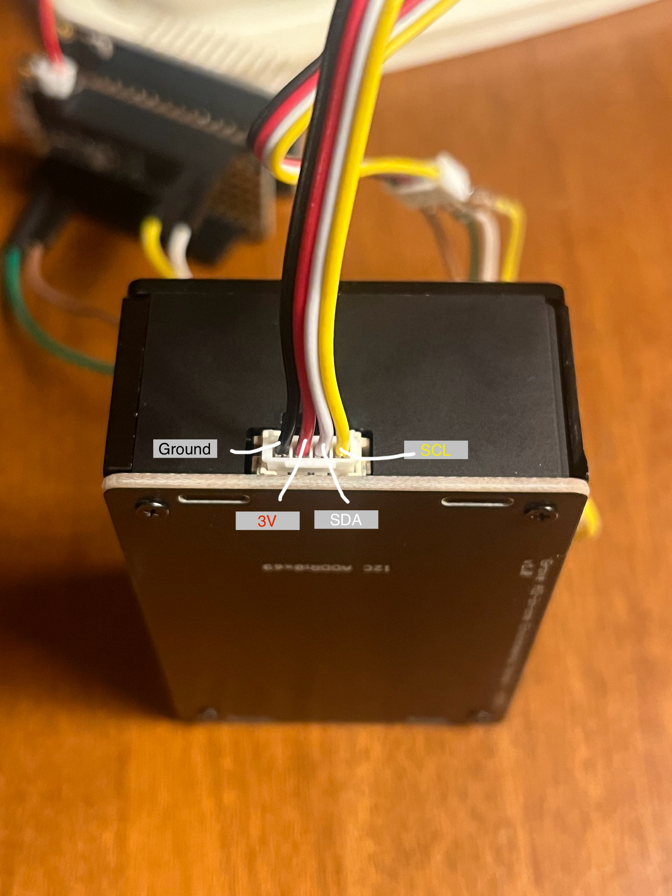
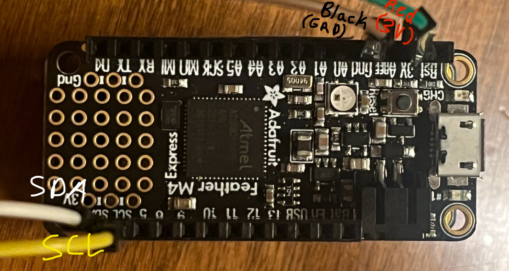

## Getting Started

### 1. Required Components
- Adafruit Feather M4 Express - https://www.adafruit.com/product/3857
- Adafruit AirLift FeatherWing - https://www.adafruit.com/product/4264
- (Sex5x) Grove SEN5X All in One - https://www.seeedstudio.com/Grove-All-in-one-Environmental-Sensor-SEN54-p-5374.html

### 2. Installing Required Software
- M4 Express - https://learn.adafruit.com/adafruit-feather-m4-express-atsamd51/setup
- Airlift Featherwing - https://learn.adafruit.com/adafruit-airlift-featherwing-esp32-wifi-co-processor-featherwing/arduino
- Sen5x - https://wiki.seeedstudio.com/Grove_SEN5X_All_in_One/

### 3. Building the Circuit
**Step 1** - Stack M4 Express on Airlift Featherwing

**Step 2** - Wire the Sen5x to the M4 Express  (Picutes below)

**Sen5x**



**M4 Express**



That's it! The circuit is that easy!

### 5. Cloning this github repo
1. Navigate to the directory you want this code in
2. Clone is using the command below
```
git clone https://github.com/curtisprogramming/Greenhouse-Sensor-System
```

### 6. Adding a Secrets.h file containing Wifi and API info
1. Create file named Secrets.h in the smae folder as the rest of the code
2. Add the following code
```
#define SECRET_SSID "MySSID" // replace MySSID with your WiFi network name
#define SECRET_PASS "MyPassword" // replace MyPassword with your WiFi password
#define SECRET_CH_ID 000000	// replace 0000000 with your channel number
#define SECRET_WRITE_APIKEY "XYZ" // replace XYZ with your channel write API Key
```
3. Insert the correct wifi network password and username

### 7. Creating a thingspeak channel
1. Go to [thingspeak.com](https://thingspeak.com/)
2. Create an account
3. Add a channel
4. Add two fields to the channel
   
   Field 1: Temperature
   
   Filed 2: Humidity
6. Locate the Write API key and Channel ID and add it to Secrets.h

### 8. Running the code
1. Ensure all the steps above are complted properly
2. Plug in the M4 Express to the computer via micro USB
3. Select the M4 Express in the Arduino IDE as the board for compiling
4. Select the M4 Express in the Arduino IDE as the board for uploading
5. Upload the code
6. Open the serial port and ensure it connects to the internet
7. Open thingspeak channel online and see the data get tracked!
